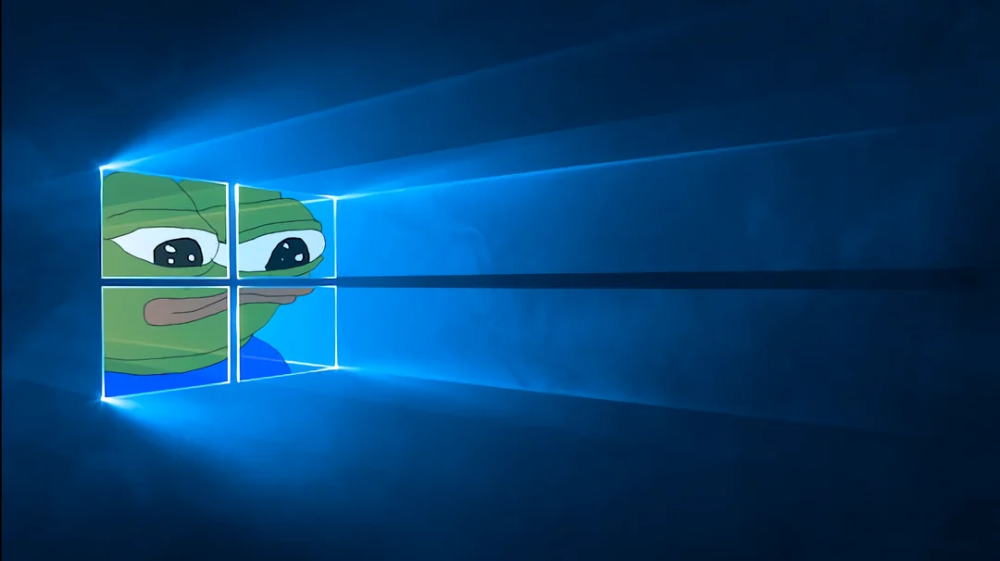
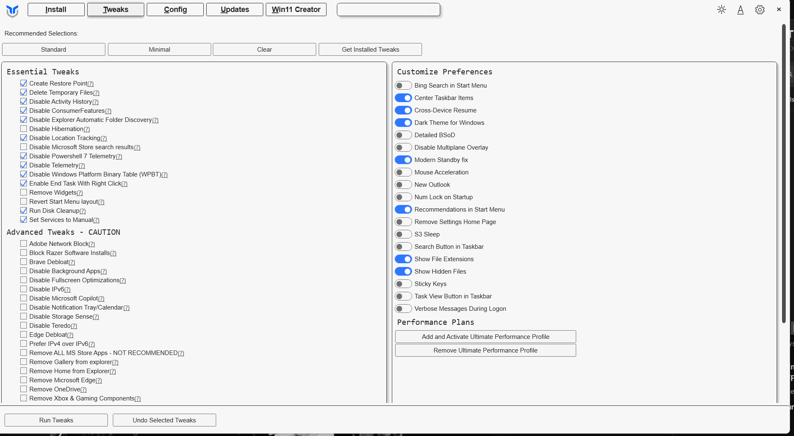
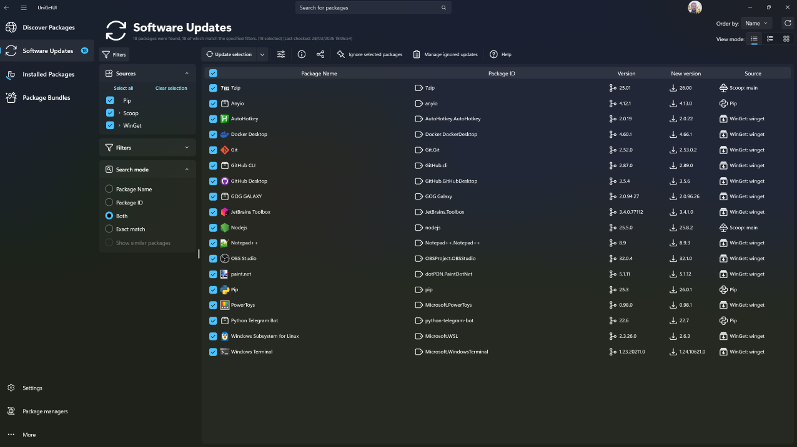
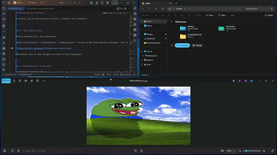
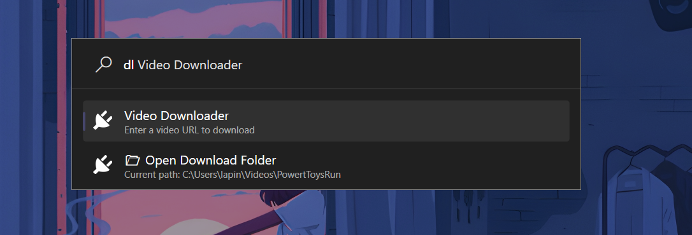
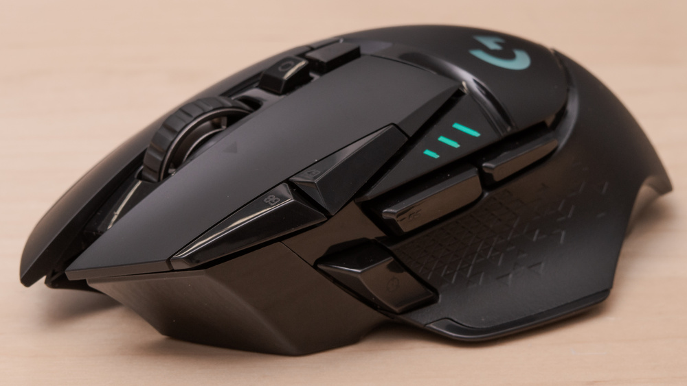
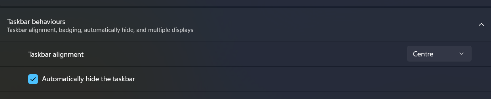

# Initial Windows Setup Reference

Some common tweaks, tools, and workflows I set up on a fresh Windows install.

---

## 0. First things first

Get a proper manly wallpaper on there. Delete all desktop icons.



Everything else in this document is built on this foundation.

---

## 1. Making Windows 11 bearable

### System Cleanup

[ChrisTitus WinUtil](https://github.com/christitustech/winutil)

```powershell
# ChrisTitus WinUtil — run in PowerShell as Admin
irm christitus.com/win | iex
```

Removes telemetry and other crap. Just the standard selection is fine.

While you're in there: go to the **Tweaks** tab → select **High Performance** (or **Ultimate Performance** if it shows up).



### Package Management

| Tool | Notes                                                                                                                                                                                                                                                                                                    |
|---|----------------------------------------------------------------------------------------------------------------------------------------------------------------------------------------------------------------------------------------------------------------------------------------------------------|
| [UniGetUI](https://github.com/Devolutions/UniGetUI) | GUI frontend for Windows package managers. Covers WinGet, Scoop, Chocolatey, pip, npm, .NET Tool, and PowerShell Gallery — all in one place. |

```powershell
# Install via WinGet
winget install --exact --id MartiCliment.UniGetUI --source winget
```

> The package export/import feature is genuinely useful — snapshot your entire installed software list and restore it on a fresh machine in one go. Beats reinstalling everything manually after a Windows nuke.



### Window Management

Tiling is handled via a custom AutoHotkey script to tile all open windows in a grid, toggles back to maximised on second press. No dedicated tiling WM needed.

**Hotkey:** `Ctrl + Alt + T` — toggles between tiled grid and maximised.

Requires [AutoHotkey](https://www.autohotkey.com/). Grab the script: [TileWindows.ahk](https://github.com/CostaFot/autohotkey/blob/main/TileWindows.ahk). Save it and double-click to run. You'll see an `H` in the system tray.



**Grid behaviour:**
- 2 windows → side by side, full height
- 3 windows → 2×2 grid, last window stretches to fill its row
- 4 windows → 2×2 grid, equal
- 5 windows → 3×2, last row fills equally
- n windows → nearest square root grid

**Autostart on login:**
1. `Win + R` → type `shell:startup` → Enter
2. Create a shortcut to your `.ahk` file inside that folder

**If you want to go further: GlazeWM**

[GlazeWM](https://github.com/glzr-io/glazewm) - every new window splits the available space automatically.

Install via WinGet:

```powershell
winget install glzr-io.GlazeWM
```

I am not the biggest fan of it but hey, it works.

### Terminal

I just use Windows Terminal. WSL2 provides a real Linux shell when needed anyway.

Git Bash for a quick Unixy terminal just for fun while on Windows.

```powershell
winget install --id Git.Git -e --source winget
```

### Launchers / Spotlight Alternatives

| Tool | Notes                                                                          |
|---|--------------------------------------------------------------------------------|
| PowerToys Run (`Alt + Space`) | Enough for 99% of cases.                                                       |
| Windows Command Palette | Supposed to be PowerToys Run 2.0? Still needs some cooking. Not convinced yet. |
| [Flow Launcher](https://www.flowlauncher.com/) | Not bad but PowerToys Run works fine                                           |
| [Everything + EverythingToolbar](https://www.voidtools.com/) | File search only. Really fast. Bit of an overkill.                             |

#### PowerToys Run plugins

| Plugin | Notes |
|---|---|
| [Video Downloader](https://github.com/ruslanlap/PowerToysRun-VideoDownloader) | Download videos from YouTube and 1000+ sites directly from PowerToys Run. Type `dl <url>` and hit Enter. Supports MP4, MP3, quality selection, subtitles. |

**Usage:** `Alt + Space` → `dl https://youtube.com/...` → Enter.



### Radial Menu

| Tool | Notes                                                                |
|---|----------------------------------------------------------------------|
| [Kando](https://github.com/kando-menu/kando) | Cross-platform pie/radial menu. Very nice when using only the mouse. |

> Kando is not a keyboard-first tool — it's built around mouse gestures and radial navigation.


---

## 2. WSL2 — Windows Subsystem for Linux

Pretty much the best thing that happened to Windows the past 15 years. Gives a real Linux environment without the overhead of a traditional VM or dual boot.

### Why bother

- Run bash, zsh, grep, sed, curl, git, Python, Node — everything Linux — without dual booting
- Windows files are accessible inside Linux at `/mnt/c/`, and Linux files are accessible in Explorer via `\\wsl$\`

### Install

Open PowerShell as Admin and run:

```powershell
wsl --install
```

This installs WSL2 and Ubuntu by default. Restart when prompted.

After restart, Ubuntu will finish setting up — set a username and password when asked.

### After install

Update packages inside WSL immediately:

```bash
sudo apt update && sudo apt upgrade -y
```

Set up git identity inside WSL (separate from Windows git config):

```bash
git config --global user.name "Your Name"
git config --global user.email "you@example.com"
```

### Accessing files

| What | How |
|---|---|
| Windows files from Linux | `/mnt/c/Users/YourName/` |
| Linux files from Windows | `\\wsl$\Ubuntu\home\yourname\` in Explorer |
| Open current Linux folder in Explorer | `explorer.exe .` from inside WSL |
| Open current Linux folder in VS Code | `code .` from inside WSL |

> Keep project files inside the Linux filesystem (`~/projects/`) rather than under `/mnt/c/` — filesystem performance across the WSL boundary is noticeably slower for file-heavy operations.

---

### Custom AHK scripts

| Shortcut | Action |
|---|---|
| `Ctrl + Alt + T` | Toggle tile/maximise all windows (TileWindows.ahk) |

---

## 3. Mouse with extra buttons

[Logitech G502 Lightspeed](https://www.logitechg.com/en-gb/shop/p/g502-lightspeed-wireless-gaming-mouse) — wireless gaming mouse with 11 programmable buttons. Used as a mouse-only control surface alongside Kando.



The G502's extra buttons are mapped to cover common actions without touching the keyboard — works well in combination with Kando's pie menu for launching/switching, and AHK hotkeys as fallback.


### Button mapping

| Button                          | Mapping                                        |
|---------------------------------|------------------------------------------------|
| Scroll wheel tilt left          | Kando/radial menu trigger                      |
| DPI shift (next to left click)  | Volume up/down                                 |
| G4 / G5 (thumb buttons)         | Shift+Alt+Tab / tile windows (TileWindows.ahk) |

### Software

| Tool | Notes |
|---|---|
| [Logitech G HUB](https://www.logitechg.com/en-gb/innovation/g-hub.html) | Official software. Per-app profiles, button remapping, macro recording, DPI config, RGB. |

---

## 4. Hiding the taskbar

The whole point of this setup is a single screen desktop with no distractions and maximum space for windows.

With the AHK tiling script handling window layout and Kando on the mouse for launching, the taskbar is mostly dead screen real estate.

### How to auto-hide

1. Right-click the taskbar → **Taskbar settings**
2. Under **Taskbar behaviours** → check **Automatically hide the taskbar**

The taskbar slides out of view when not in use and reappears when you move the mouse to the bottom edge of the screen.



### Caveat

With auto-hide enabled, notification badges and tray alerts are hidden until you hover the bottom edge. I don't care about that stuff, but maybe you do.


### If you want to go further

[TranslucentTB](https://github.com/TranslucentTB/TranslucentTB) makes the taskbar transparent or blurred when visible — pairs well with auto-hide since the taskbar becomes visually lightweight when it does appear.

---

## 5. Startup configuration

Everything that needs to run on login and how to set it up.

### The startup folder

The universal method for anything that doesn't have a built-in autostart toggle:

1. `Win + R` → type `shell:startup` → Enter
2. Drop a shortcut to the app or script inside the folder

### What to put in startup

| App | How |
|---|---|
| **TileWindows.ahk** | Shortcut to `.ahk` file in `shell:startup` |
| **Kando** | Shortcut in `shell:startup` |
| **PowerToys** | Has a built-in autostart toggle |
| **Logitech G HUB** | Has a built-in autostart toggle |
| **LocalSend** | Has a built-in autostart toggle — Settings → Start hidden |

---

## 6. File sharing between devices

### LocalSend

[LocalSend](https://localsend.org/) — open source AirDrop equivalent. Transfers files between any devices on the same WiFi network with no internet, no account, no cloud, no cables. Works across Windows, macOS, Linux, Android, and iOS in any combination.

**No setup** — install on both devices, they discover each other automatically

```powershell
winget install LocalSend.LocalSend
```
Or download from [localsend.org/download](https://localsend.org/download).

---

## 7. Screenshots

### tinyshots

[tinyshots](https://www.tinyshots.app/web) — browser-based screenshot beautifier. Paste or drop a screenshot, add padding, rounded corners, gradient/solid backgrounds, shadows, and browser/device frames.

Good for blog post screenshots, social posts, or anything really.

**Usage:** go to [tinyshots.app/web](https://www.tinyshots.app/web) → paste screenshot (`Ctrl + V`) or drop a file → adjust padding, background, and frame → export.


> Pair with `PRTSC` (Windows Snipping Tool) for the capture step — select region, it goes to clipboard, paste straight into tinyshots.

---

## 9. Text editing

For quick edits to config files, scripts, logs, and anything that doesn't need a full IDE open.

### Notepad++

[Notepad++](https://notepad-plus-plus.org/) — the Windows text editor. Syntax highlighting for everything, tabs, find/replace with regex, column editing, macros, plugins. Free, open source, has been around since 2003 and still gets updates.

**Install via WinGet:**

```powershell
winget install Notepad++.Notepad++
```